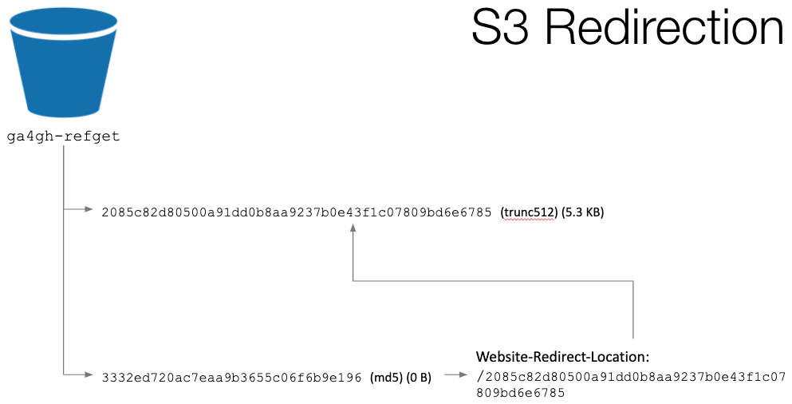
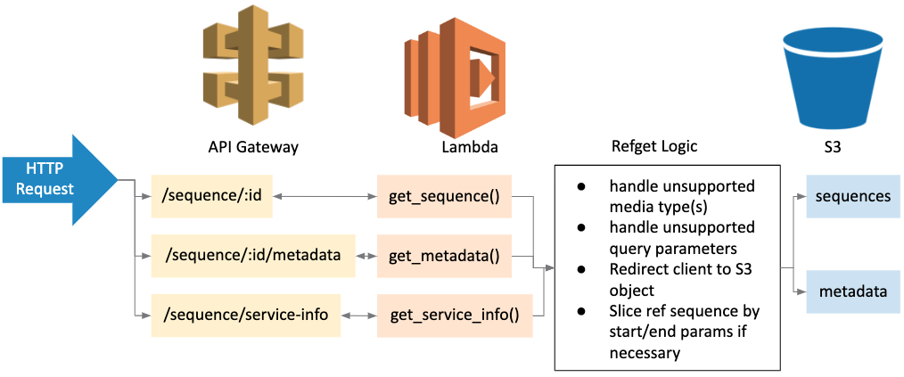

[](https://ga4gh.org)

[](https://opensource.org/licenses/Apache-2.0)
[](https://travis-ci.org/ga4gh/refget-serverless)
[](https://coveralls.io/github/ga4gh/refget-serverless?branch=master)
[](https://refget-serverless.readthedocs.io/en/latest/?badge=latest)

# Refget Cloud

Configurable, python-based Refget web service. Can be configured to run in multiple deployment contexts (e.g. containerized server, serverless) and serve data from multiple cloud-based sources.

Refget Cloud is an implementation of the [Refget API Specification v1.0.0](https://samtools.github.io/hts-specs/refget.html), developed by the [Global Alliance for Genomics and Health](https://www.ga4gh.org/).

Currently, this codebase has been deployed to serve reference sequences from the [International Nucleotide Sequence Database Collaboration (INSDC)](http://www.insdc.org/). Click [here](https://refget-insdc.jeremy-codes.com/index.html) to view its OpenAPI documentation and begin accessing sequences.

If you are interested in setting up your own serverless implementation of refget using a cloud-based object store, please review the [documention](docs/INDEX.md) to get started.

## Supported Deployment Contexts

* AWS Serverless / Lambda 
* AWS ECS + Fargate

## Supported Data Sources

* AWS S3 

# Usage

The web service implements all API methods as described in the [Refget Specification](https://samtools.github.io/hts-specs/refget.html):
* Get sequence by ID
* Get known sequence metadata by ID
* Fetch information on the service

Redirects should be allowed when requesting sequences, as some requests can be handled directly by the Public Dataset bucket. Currently, the web service is not configured to support circular sequences.

## Get Sequence

Using the complete genome sequence of Coliphage phi-X174 as an example, which has a `TRUNC512` checksum digest and ID of `2085c82d80500a91dd0b8aa9237b0e43f1c07809bd6e6785`, we can retrieve the complete genome sequence via the `/sequence/:id` route:
```
curl -L https://cl9lba3no5.execute-api.us-east-2.amazonaws.com/Prod/sequence/2085c82d80500a91dd0b8aa9237b0e43f1c07809bd6e6785
```

We can also obtain the same sequence by its `MD5` checksum/ID, `3332ed720ac7eaa9b3655c06f6b9e196`:
```
curl -L https://cl9lba3no5.execute-api.us-east-2.amazonaws.com/Prod/sequence/3332ed720ac7eaa9b3655c06f6b9e196
```

We can obtain subsequences by providing start and/or end query parameters:
```
curl -L https://cl9lba3no5.execute-api.us-east-2.amazonaws.com/Prod/sequence/3332ed720ac7eaa9b3655c06f6b9e196?start=100\&end=200
```

We can also obtain subsequences by providing a 'Range' header:
```
curl -L -H "Range: bytes=100-200" https://cl9lba3no5.execute-api.us-east-2.amazonaws.com/Prod/sequence/3332ed720ac7eaa9b3655c06f6b9e196
```

## Get Metadata

We can obtain sequence metadata via the `/sequence/:id/metadata` route:
```
curl -L https://cl9lba3no5.execute-api.us-east-2.amazonaws.com/Prod/sequence/3332ed720ac7eaa9b3655c06f6b9e196/metadata
```

## Get Service Info

We can obtain information on the web service via the `/sequence/service-info` route:
```
curl -L https://cl9lba3no5.execute-api.us-east-2.amazonaws.com/Prod/sequence/service-info
```

# Features

## S3 Object Redirection

As sequences are retrieved by either their `TRUNC512` or `MD5` checksum digests, there must be a way to access the correct sequence by either ID. This has been achieved using only S3 object properties, without needing to duplicate data, and without the need for a database keeping track of the mapping between `MD5 <--> TRUNC512`.

The diagram below shows that raw sequences are stored in s3 objects, with filenames matching the `TRUNC512` id. If a client requests a sequence by `TRUNC512`, the corresponding file contents are retrieved.

Within the bucket, there also exists an empty file/object, with filename matching the sequence `MD5` id. This empty file has an s3 header, `Website-Redirect-Location`, with a value mapping it back to the `TRUNC512` file.



## Serverless Architecture

The AWS Serverless Application Model (SAM) allows us to easily map API routes to lambda functions that handle the client's request, without needing to directly manage server infrastructure. A common library initially handles the user's request to ensure the service conforms to the refget specification. If the HTTP request is valid (correct headers, query string parameters), the service can redirect the client to the correct s3 object with minimal preprocessing.


