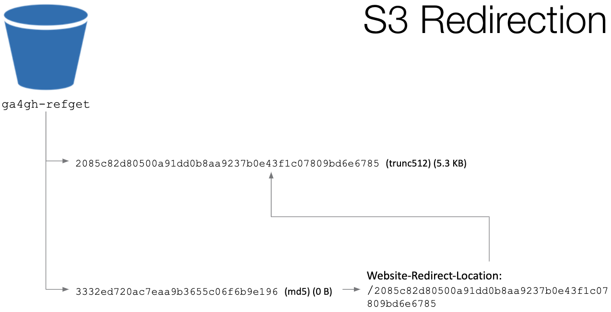

# Using AWS S3 as a Data Source

This guide outlines how to setup and use an Amazon AWS S3 bucket as a data source for the refget server.

## Overview

### S3 Redirection

As reference sequences and metadata can be retrieved by multiple checksum identifiers, (`MD5`, `TRUNC512`, `ga4gh`), there must be a way to access the correct sequence by either ID. In S3, this can be achieved without data duplication and without a database layer using only S3 object properties and redirection.

The following diagram illustrates how raw sequences are stored in S3 objects, with filenames matching the `TRUNC512` id. If a client requests a sequence by `TRUNC512`, the file contents are retrieved.

Within the bucket, there also exists an empty object, with filename matching the sequence `MD5` id. The empty file contains an object header, `Website-Redirect-Location`, with a value mapping it back to the `TRUNC512` file.

Sequence content and metadata only need to be stored under one checksum identifier (the primary identifier). An unlimited number of additional checksum identifiers (secondary identifiers) can be supported by the S3 bucket, by simply having these empty objects redirect to the primary identifer.

### S3 Content-Type Headers

Sequence and metadata objects in the S3 bucket must have `Content-Type` headers to fulfill the Refget specification. These can be vendor-specific or vendor neutral. Each sequence object should have a `Content-Type` header of `text/vnd.ga4gh.refget.v1.0.0+plain` or `text/plain`. Each metadata object should have a `Content-Type` header of `application/vnd.ga4gh.refget.v1.0.0+json` or `application/json`.

The above 2 considerations (checksum redirection, content type headers) are handled automatically when uploading to S3 via the [refget-loader](https://github.com/ga4gh/refget-loader) utility. The refget-loader processes reference sequences into refget format, then uploads them to cloud storage. It is the preferred method for setting up a refget web service data source.

## Setup Guidelines

Create an AWS S3 account in your chosen region, enable **Public Read** permissions and **Static website hosting** for the entire bucket. This will allow objects in the S3 bucket to be accessed via https requests.

To populate the S3 bucket with sequences, we recommend using the [refget-loader](https://github.com/ga4gh/refget-loader). As a prerequisite, the [AWS cli tool](https://aws.amazon.com/cli/) should be installed on your system, with valid credentials to write to the S3 bucket already configured.
