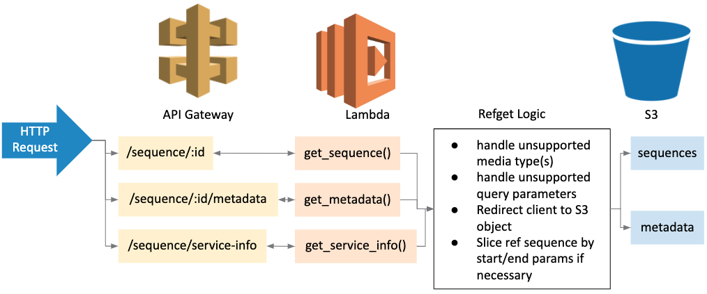

# Deploying Serverless Refget on AWS with Lambda

## Overview

The core Refget specification functions (get sequence, get metadata, get service info) can be mapped to serverless functions and associated with API routes using AWS API Gateway and Lambda.

An example AWS Cloudformation template for deploying a serverless Refget stack is available [here](../../iac/aws/lambda/template.yaml). The template can be modified to suit additional design considerations.

